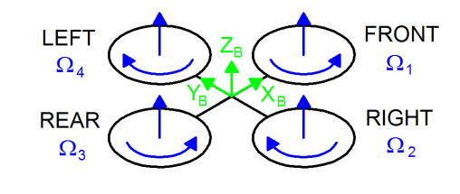
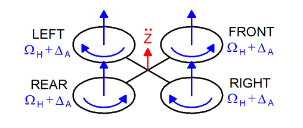
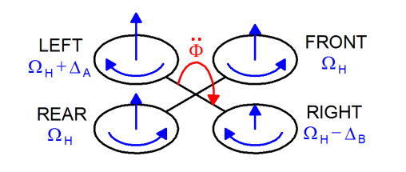
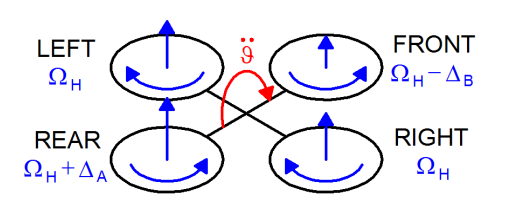
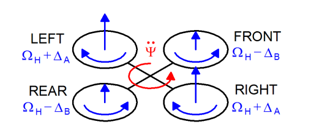
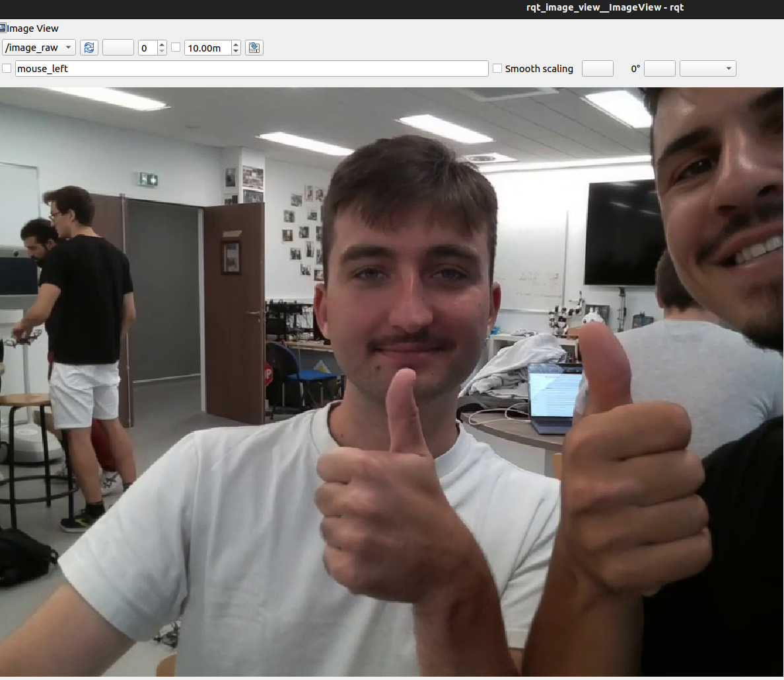
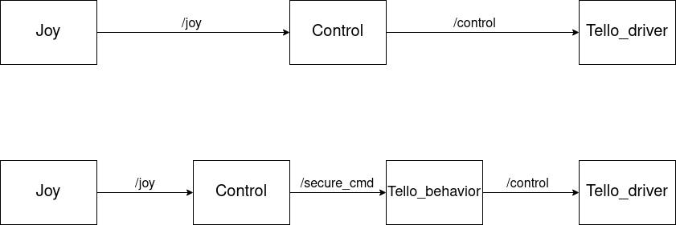

# Projet Tello Ros2

## Auteurs
- Adrien Pouxviel
- Arnaud Ville

## Projet : avancement et résultats
L'objectif du projet était de mettre en place différents scénarios sur les drones Tello-EDU. 


Nous avons mis en place les scénarios suivants : 

- contrôle manuel du drone grâce à une manette connectée au PC : tous les mouvements linéaires (haut, bas, gauche, droite, avant, arrière) et angulaires (rotations gauche, droite) du drone sont fluides et nous pouvons suivre le drone via la caméra.
- mode surveillance : le drone déclenche un mouvement automatique de surveillance jusqu'à son arrêt ou un changement de mode (rotation selon son axe z).
- déclenchement de comportements spécifiques à la lecture de QR code : ici nous donnons simplement l'ordre au drone de se déplacer latéralement grâce a un premier QR Code puis d'atterrir grâce à la lecture d'un deuxième QR code
- mode follower : le drone suit les mouvements d'un QR code et se place face à son centre. Cette fonctionnalité n'est pas encore totalement optimale et mériterait d'être affinée. En effet, pour l'instant le drone suit bien le QR code pour des mouvements latéraux et vers le bas mais ne suit pas bien le QR code vers le haut.

Il est possible de switcher entre tous ces modes grâce au service `drone_mode` du noeud `Tello_behavior`. Ces changement d'état peuvent être actionnés depuis un terminal. 

## Démos

Vous pouvez retrouver ici les courtes démonstrations des modes manuel, surveillance et lecture de QR code : 
- [Mode Manuel](https://www.youtube.com/shorts/2aqIRtRptik)
- [Mode Surveillance](https://www.youtube.com/shorts/1Ng4YtUN8_Q)
- [Mode Lecture QR code](https://www.youtube.com/shorts/97IpgAsv_8Y)


## Tello behavior (gestion des changements de mode)
Le noeud `Tello_behavior` va agir comme un bypass et laisser passer les topics du noeud `Control` en mode manuel. Dans les autres modes, il viendra filtrer les commandes envoyées par `Control` empêchant ainsi à l'utilisateur de commander le drone avec la manette excepté pour les commandes d'urgence arrêt, décollage et atterrissage.

Comme dit précédemment, on peut switcher de mode depuis le terminal en appelant le service `drone_mode`.
Commande permettant de switcher de mode : 
`ros2 service call /drone_mode interfaces/srv/ChangeDroneMode "drone_mode: X"`
X étant un int correspondant au mode souhaité

```
case 0 = mode surveillance 
case 1 = mode manuel
case 2 = mode scenario (activé avec QR codes)
case 3 = mode follower de QR codes
```

Nous expliquons dans la Question 5 le processus qui permet d'aboutir à ce résultat.

## Mise en route globale 
Il faut tout d'abord s'assurer d'etre bien connecté au drone en wifi, d'avoir compilé et bien sourcé le workspace. 

Il faut alors lancer les nodes Tello_behavior, Control, Tello, Joy, Zbar_ros et Rqt_image_view directement via le launch file : `ros2 launch dev_drone launch.py ` (on se trouve à ce moment dans le workspace)

A cet instant, seules les commandes d'urgence sont actives. Il faut lancer dans un autre terminal le service `drone_mode` avec le mode voulu : 
`ros2 service call /drone_mode interfaces/srv/ChangeDroneMode "drone_mode: 0"`

## Contrôle manuel
Les touches de la manette ont été mappé comme suivant : 

```
Y = décollqge 
A = atterrissage
B = arrêt d'urgence
Joystick Gauche = mouvements latéraux
Joystick Droit = rotations gauche et droite
LB = descendre
RB = monter 
Flèches = flip (même direction que la flèche)
```


## Questions 
#### Q1
 Quelles sont les quatre commandes classiques d’un drone quadrirotor ? A l’aide de schémas et de repères que vous aurez fixés, expliquez comment peut-on contrôler la trajectoire d’un drone quadricoptère.

Les 4 commandes classiques d'un drone quadrirotor sont : throttle, roll, pitch, yaw

Schéma d'un drone en vol stationnaire. 


Le même repère sera utilisé dans les schémas suivants. La vitesse des hélices est specifiée en bleu (ΩH) et ∆A [rad s-1] est une variable positive qui représente un incrément par rapport à la constante ΩH. 
∆A et ∆B [rad s-1] sont choisies pour maintenir la poussée verticale inchangée pour toutes les commandes.

- Throttle


Cette commande est fournie en augmentant (ou en diminuant) toutes les vitesses d'hélice de la même manière. Cela conduit à une force verticale qui soulève ou abaisse le quadrotor.

- Roll


Cette commande est fournie en augmentant (ou en diminuant) la vitesse de l'hélice gauche et en diminuant (ou en augmentant) la vitesse de l'hélice droite. Elle entraîne un couple par rapport à l'axe xB qui fait tourner le quadrotor.

- Pitch 


Cette commande est très similaire au Roll et est fournie en augmentant (ou en diminuant) la vitesse de l'hélice arrière et en diminuant (ou en augmentant) celle de l'hélice avant. Elle entraîne un couple par rapport à l'axe yB qui fait tourner le quadrotor. 

- Yaw 


Cette commande est fournie en augmentant (ou en diminuant) la vitesse des hélices avant-arrière et en diminuant (ou en augmentant) celle du couple gauche-droite. Elle entraîne un couple par rapport à l'axe zB qui fait tourner le quadrotor.
Le mouvement de "yaw" est généré par le fait que les hélices gauche-droite tournent dans le sens des aiguilles d'une montre alors que les hélices avant-arrière tournent dans le sens inverse. Ainsi, lorsque le couple global est déséquilibré, l'hélicoptère tourne sur lui-même autour de zB.


*Sources : Tommaso Bresciani, "Modelling, Identification and Control of a Quadrator Helicopter"*

#### Q2
Quels topics correspondent à la commande du drone ?
Quel est respectivement le type de chacun des messages associés ?

Les topics qui correspondent à la comamnde du drone sont : control, emergency, flip, land et takeoff 

Voici les type de chacun des messages associés (/topic [type_de_message]): 
/control [geometry_msgs/msg/Twist]
/emergency [std_msgs/msg/Empty]
/flip [std_msgs/msg/String]
/land [std_msgs/msg/Empty]
/takeoff [std_msgs/msg/Empty]

#### Q3
N'hésitez pas à faire un petit selfie-drone dans votre rapport avec les retours caméra selon les 2 méthodes.

- rviz 
- rqt2 

#### Q4
Mettez un petit screenshot de l'évolution de la mesure du capteur tof.

Ce screen montre l'évolution de la mesure du capteur tof en éloignant le drone de la surface du sol : 


#### Q5
Vous remarquerez que le topic sortant de joy à changé. Comment aller vous procéder pour faire cela ? Quel est l'intérêt ? Pourquoi effectuer le changement en sortie de joy est intéressant plutôt qu'autre part ?

Nous avons remapé le topic en sortie de Control en `/secure_cmd` dans notre launch file. 
L'intérêt est de pouvoir traiter ces commandes de mouvement du drone dans Tello_behavior et ainsi pouvoir créer différents scénarios. On pourra par exemple décider de passer en mode manuel, surveillance ou lecture de QR codes. Ces changements d'état s'effectuent depuis l'extérieur du script (avec un terminal) avant de renvoyer le topic `/control` à `Tello_driver` qui actionera les mouvements.



Il est plus intéressant d'effectuer ce changement en sortie de `Control` car il va permettre par la suite au noeud Tello_behavior d'agir comme un filtre pour les commandes envoyées par Control pour ne laisser que les commandes d'arrêt d'urgence, de décollage et d'atterrissage dans les modes hormis le mode manuel.
